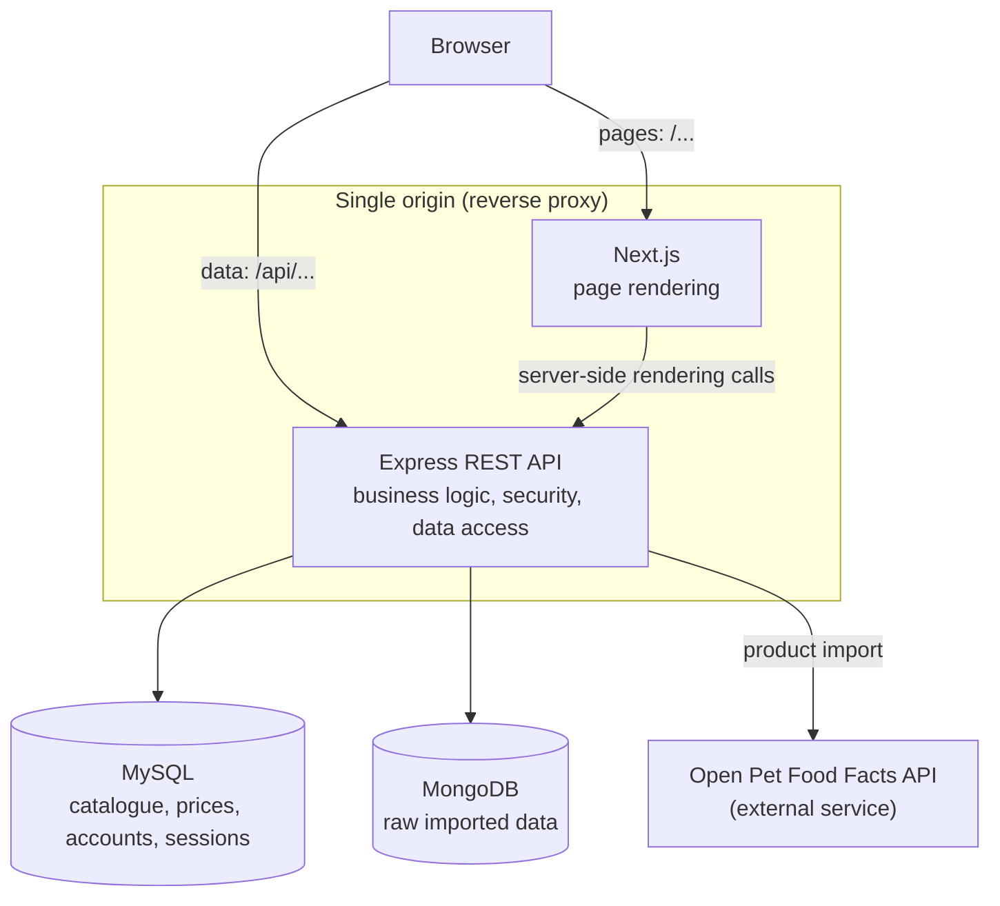
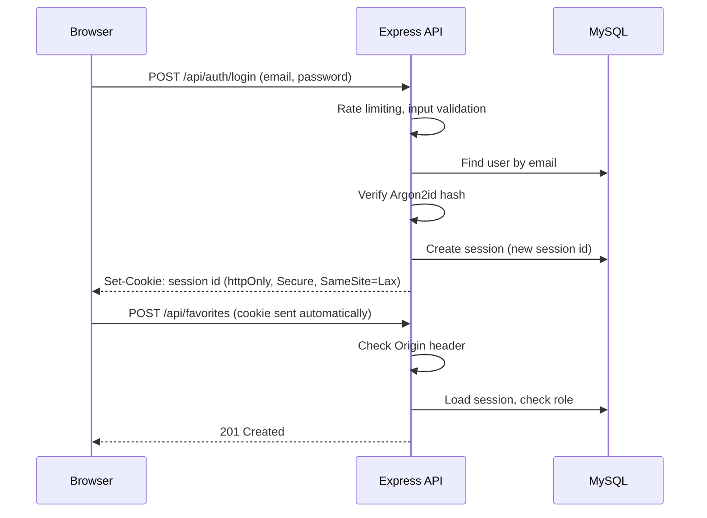
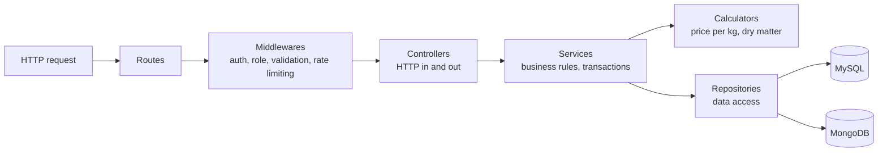

# Software architecture

> Status: validated during the design phase (issue #3 for the technology stack, issue #4 for the architecture).
> Nothing described here is implemented yet.

## 1. Overview

The application is made of two Node.js applications and two databases:

- **Web application (Next.js)**: renders the pages. Public pages are rendered on the server for search engine optimisation; interactive parts run in the browser. It contains **no business logic**.
- **REST API (Express)**: business rules, security, data access. It is the single entry point to the data.
- **MySQL**: reference data (catalogue, prices, accounts, sessions).
- **MongoDB**: raw data imported from Open Pet Food Facts (exact role to be confirmed in issue #7).



## 2. Single origin

The browser sees a single site:

| Path | Served by |
|---|---|
| `/...` | Next.js |
| `/api/...` | Express API |

- **Production**: a reverse proxy routes requests to the right application according to the path. Its configuration is part of the deployment documentation.
- **Development**: Next.js forwards `/api/*` to the Express API with its `rewrites` configuration.
- **Server-side rendering**: Next.js calls the API directly through an internal URL (environment variable), without going through the browser.

Reasons:

- session cookies work without cross-site configuration;
- no CORS configuration is needed, which removes a common source of security misconfiguration.

## 3. Rendering strategy

| Pages | Rendering | Reason |
|---|---|---|
| Home, search results, product page, legal pages | Server-side | Search engine optimisation |
| Filters, sorting, selection, comparator | Client-side | Interactivity |
| Member area, back office | Client-side, `noindex` | Private pages, not meant to be indexed |

Search filters and the comparison selection are stored **in the URL** (for example `/croquettes?bodySize=4&lifeStage=2` or `/compare?products=12,15,21`):

- a search or a comparison can be shared with a link;
- the browser back button works as expected;
- the server can render the right results directly.

## 4. Authentication and session security

Authentication uses **server-side sessions stored in MySQL**.



Security measures:

| Measure | Purpose |
|---|---|
| `httpOnly` cookie | The session id cannot be read by JavaScript (mitigates XSS impact) |
| `Secure` cookie (production) | The cookie is only sent over HTTPS |
| `SameSite=Lax` cookie | The cookie is not sent by other sites on state-changing requests |
| `Origin` header check on state-changing requests | Second layer of CSRF protection |
| New session id at login | Prevents session fixation |
| Session deleted at logout and account deletion | Immediate revocation |
| Argon2id password hashing | Algorithm recommended first by OWASP |
| Login rate limiting | Slows down brute-force attacks |
| Generic login error message | Does not reveal whether an email address exists |

Rejected alternative: **JWT**. A token stays valid until it expires (no immediate logout or revocation without a deny list), and storing it in `localStorage` exposes it to XSS. JWT fits multiple services or mobile clients, which is not the case here.

**Rule: security is enforced by the API, never only by the user interface.** Next.js may redirect an anonymous visitor for convenience, but the API is what refuses access.

## 5. API internal architecture

The API is organised in layers. Each layer has a single responsibility and is implemented as classes.



| Layer | Responsibility | Example |
|---|---|---|
| Routes | Map a URL and a method to a controller | `GET /api/products/:slug` |
| Middlewares | Cross-cutting concerns | `requireRole('admin')` |
| Controllers | Read the request, call a service, send the HTTP response | `ProductController` |
| Services | Business rules and transactions | `ProductService.publish()` checks the publication rules |
| Calculators | Pure business calculations, without dependencies | `PriceCalculator`, `NutritionCalculator` |
| Repositories | Data access only | `ProductRepository` (MySQL), `ImportRepository` (MongoDB) |

Design principles:

- **Dependency injection through constructors**: a service receives its repositories as parameters, so it can be unit tested with test doubles, without a database.
- **Validation at the edge**: every input is validated with Zod schemas before reaching the controllers.
- **Typed errors, centralised handling**: services throw typed errors (`NotFoundError`, `ValidationError`, `ConflictError`, `ForbiddenError`…); a single error-handling middleware turns them into JSON responses with a consistent format. No stack trace or internal detail is sent to the client.
- **HTTP hardening**: security headers with Helmet, request body size limit.

## 6. Web application organisation

- **Routes**: Next.js file-based routing.
- **UI components**: a small internal component library (button, form field, card, table, dialog) styled with Sass and CSS Modules, based on design tokens (CSS custom properties) from the visual identity.
- **Feature components**: search, filters, comparator, member area, back office.
- **API client**: a single module wrapping `fetch` calls to the API.
- **No business logic**: calculations and rules live in the API only.

## 7. Repository structure

```text
comparateur-croquettes/
├── api/                 # Express API (layers, tests)
├── web/                 # Next.js application
├── database/            # SQL scripts: schema, users and privileges, test data, backup
├── docs/                # Documentation
├── .github/             # Templates and continuous integration
└── docker-compose.yml   # MySQL, MongoDB, administration tool
```

Each application has its own `package.json`; no monorepo tooling is used.

## 8. Development environment

- MySQL, MongoDB and an administration tool run in Docker containers.
- Next.js and the Express API run directly on the host machine.
- Configuration is provided through environment variables (`.env` files, never committed; `.env.example` files are committed).

## 9. Open points

| Topic | Issue |
|---|---|
| Exact role of MongoDB and import flow | #7 |
| REST API contract (endpoints, error format, pagination) | #8 |
| Data model (MCD, MLD) | #5, #6 |
