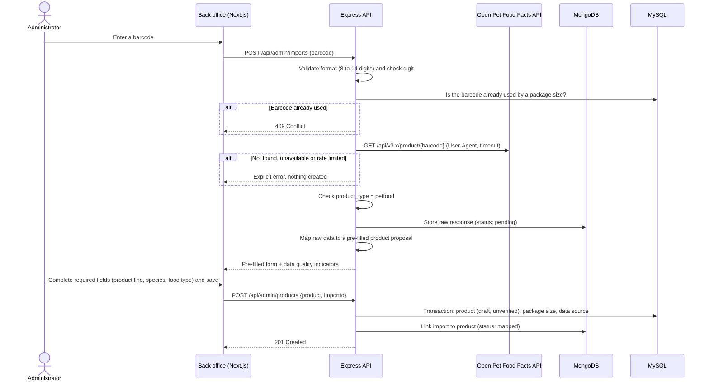

# Data import from Open Pet Food Facts

> Status: validated during the design phase (issue #7). Nothing described here is implemented yet.
> Implementation: user story US-20 (milestone M4).

## 1. Purpose

Product data comes from two sources:

1. **Official labels** (manufacturer websites, packaging): the main source, entered manually in the back office.
2. **Open Pet Food Facts**: a collaborative open database, used to **pre-fill** a product from its barcode.

Every product, whatever its source, must be checked against the official label before publication (RG-10).

## 2. Role of MongoDB

**Decision: MongoDB stores the raw responses of the Open Pet Food Facts API.** The relational database (MySQL) only contains reference data checked by an administrator.

Reasons:

- API responses are large, nested documents (about 150 fields for one product) whose structure changes between API versions: a document database without a fixed schema fits this data.
- Traceability: what Open Pet Food Facts said about a product, and when, is kept (RG-08, RG-19).
- Fewer API calls: if the mapping is improved, it can be run again on stored responses without calling the API (strict rate limits, see below).
- Clear separation between raw, unverified external data (MongoDB) and verified reference data (MySQL).

Rejected alternatives:

| Alternative | Reason |
|---|---|
| JSON column in MySQL | Technically possible and simpler for a small project; rejected to keep raw external data separate from reference data, and because the project must also demonstrate NoSQL data access components |
| MongoDB for an audit log of admin changes | Valid use, but not related to the data problem of the project |
| Mongoose | Its purpose is to enforce a schema on documents, which goes against storing raw documents; input validation is already handled by Zod |

Data access uses the **official MongoDB Node.js driver**, wrapped in an `ImportRepository` class.

## 3. Open Pet Food Facts API: facts from the documentation

| Topic | Rule |
|---|---|
| Base URL | `https://world.openpetfoodfacts.org` (same API as Open Food Facts) |
| Version | API v3 (v2 is deprecated). The sub-version is **pinned in the URL** because the product schema changes frequently (for example, a new nutrition facts structure in v3.5) |
| Endpoint | `GET /api/v3.x/product/{barcode}` |
| Identification | A custom `User-Agent` is mandatory: `comparateur-croquettes/<version> (<contact email>)`; read operations need no other authentication |
| Rate limits | 15 product reads per minute per IP address; 10 searches per minute; exceeding them may lead to an IP ban. Bulk needs (more than a few hundred products) must use the data exports instead |
| Data quality | No guarantee of accuracy or completeness; the user assumes the risk |
| Licences | Database: ODbL. Individual contents: Database Contents License. Images: CC BY-SA (may contain copyrighted elements) |

Product images are **not imported** (decision: no product photos in the application).

## 4. Data quality observed

A real response (barcode `3182550846127`, a Royal Canin dry food sold in France, retrieved in October 2026 with API v3) shows:

- completeness of 35 %;
- no ingredient list and no nutrition facts; the product states include `nutrition-facts-to-be-completed` and `ingredients-to-be-completed`;
- product name only available in the French field (`product_name_fr`), while the main language of the record is Spanish;
- last modification in October 2022.

On product web pages, the percentages shown next to analytical constituents are often **category averages** ("compared to: dog food"), not the values of the product itself.

Consequences:

- Open Pet Food Facts mainly provides **identification data** (barcode, name, brand, quantity), sometimes the ingredient list, and rarely analytical constituents.
- **Manual entry from official labels remains the main source of product data.**
- Imported products are always created as `draft` and `unverified` (RG-19).

## 5. Import flow



The product cannot be created automatically: `product.product_line_id`, `species_id` and `food_type_id` are mandatory, and Open Pet Food Facts does not know the product lines of the catalogue. An administrator must at least choose the product line before saving.

## 6. MongoDB document structure

Collection: `opff_imports`. One document per successful API call (history is kept).

```json
{
  "_id": "ObjectId",
  "barcode": "3182550846127",
  "apiVersion": "v3.x",
  "requestUrl": "https://world.openpetfoodfacts.org/api/v3.x/product/3182550846127",
  "fetchedAt": "ISODate",
  "status": "pending",
  "productId": null,
  "mappedAt": null,
  "payload": { "raw API response": "stored as received" }
}
```

| Field | Description |
|---|---|
| `barcode` | Barcode requested (8 to 14 digits) |
| `apiVersion` | Pinned API sub-version used |
| `requestUrl` | Exact URL called |
| `fetchedAt` | Date and time of the call |
| `status` | `pending` (not yet saved as a product), `mapped` (product created), `rejected` (discarded by the administrator) |
| `productId` | `product.product_id` in MySQL once mapped |
| `mappedAt` | Date and time of the mapping |
| `payload` | Raw API response, unchanged |

Database-level validation: a MongoDB `$jsonSchema` validator on the collection checks the metadata fields (barcode pattern, required dates, allowed status values). The payload itself is not validated, on purpose.

Indexes:

| Index | Query |
|---|---|
| `{ barcode: 1, fetchedAt: -1 }` | Latest import of a barcode |
| `{ status: 1 }` | Pending imports in the back office |

## 7. Field mapping

Verified on a real API v3 response. Nutrition and additive fields will be confirmed during the implementation of US-20, with the pinned API version and a product that has nutrition data.

| Open Pet Food Facts field | Target | Rule |
|---|---|---|
| `code` | `packaging.ean`, `data_source.external_id` | Barcode as text |
| `product_type` | — | Must be `petfood`, otherwise the import is refused |
| `product_name_fr`, then `product_name` | `product.name` | French field first, generic field as fallback |
| `brands` | `product_line.brand_id` (proposal) | Matched with existing brands by slug; never created automatically |
| `product_quantity` + `product_quantity_unit` | `packaging.net_weight_g` | Converted to grams (`kg` × 1000) |
| `ingredients_text_fr`, then `ingredients_text` | `product.label_composition` | To be checked against the label |
| `categories_tags` | `species_id`, `food_type_id` (proposals) | e.g. `en:dog-food` suggests the dog species; final choice by the administrator |
| `countries_tags` | — | Shown as an indication for RG-01 (not a proof) |
| `completeness`, `states_tags` | — | Shown to the administrator as data quality indicators |
| `last_modified_t` | — | Shown to the administrator (Unix timestamp converted to a date) |
| Nutrition facts | `product_constituent` | To be confirmed (structure depends on the API sub-version) |
| Additives | `product_additive` | To be confirmed |
| Images | — | Not imported |

On save, a `data_source` row is created: `source_type = open_pet_food_facts`, `external_id` = barcode, `consulted_on` = import date, `url` = product page.

## 8. Error handling

| Situation | Response to the administrator |
|---|---|
| Invalid format or check digit | Validation error, no API call |
| Barcode already used by a package size | Conflict, no API call |
| Product not found | "Unknown barcode", nothing created |
| `product_type` other than `petfood` | "Not a pet food product", nothing created |
| Timeout, network error, server error | "Service unavailable, try again later", nothing created |
| Rate limit reached (HTTP 429 or 503) | "Too many requests, try again later", nothing created |

## 9. Licence obligations

- **Attribution**: pages showing data from Open Pet Food Facts mention the source and the ODbL licence (US-22, RG-08).
- **Share-alike**: if a database derived from Open Pet Food Facts data is made public, it must be released under the ODbL.
- **Images**: not imported, which avoids the rights attached to packaging visuals.
- The terms of use and the API usage form of Open Food Facts are to be read and completed before production use.

## 10. Testing

- The API is never called by automated tests: recorded responses (fixtures) are used instead.
- Unit tests: barcode check digit, quantity conversion, field mapping, error mapping.
- Integration tests: repository against a test MongoDB database.
